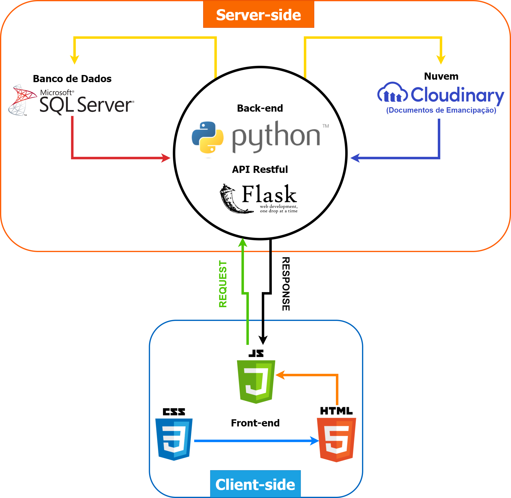

 # Tópicos Avançados de Banco de Dados

## Índice

-  [Entregas](#entregas)
    - [Kick Off](#kick-off-) - 28/02/2021 a 06/03/2021 
    - [Sprint 01](#Sprint-01-) – 08/03/2021 a 28/03/2021
    - [Sprint 02](#sprint-02-) - 29/03/2021 a 18/04/2021
    - [Sprint 03](#sprint-03-)  - 26/04/2021 a 16/05/2021
    - [Sprint 04](#sprint-04) - 17/05/2021 a 05/06/2021

## Equipe

- 👩‍💻 [Giovanna Xavier Matos](https://www.linkedin.com/in/giovanna-xavier-matos-975538156/) : _Dev_
- 👨‍💻 [Hercules Pereira](https://www.linkedin.com/in/hercules-pereira/) : _Dev_
- 👩‍💻 [Leticia Macedo Prudente de Carvalho](https://www.linkedin.com/mwlite/in/leticia-macedo-prudente-de-carvalho-a0413416a/) : _Scrum Master_
- 👨‍💻 [Sandro Toline](https://www.linkedin.com/in/sandro-toline-149997115/) : _Dev_
- 👩‍💻 [Thaís Bitencourt de Meneses](https://www.linkedin.com/in/thaisbitencourt/) : _Product Owner_
- 👨‍💻 [Thiago Dias](https://www.linkedin.com/in/thiago-dias-19919616b/) : _Dev_
- 👨‍💻 [Yan Rodrigues de Azevedo](https://www.linkedin.com/in/yan-rodrigues/) : _Dev_
- 👨‍💻 [Victor Cardial](https://www.linkedin.com/in/victor-cardial-de-menezes-pereira-67491018a/) : _Dev_

### Matéria: Tópicos Avançados de Banco de Dados
### Professor: Eduardo Sakaue

### Problema:
Considerando a Lei Geral de Proteção de Dados, Artigo 1º: “Esta Lei dispõe sobre o tratamento de dados pessoais, inclusive nos meios digitais, por pessoa natural ou por pessoa jurídica de direito público ou privado, com o objetivo de proteger os direitos fundamentais de liberdade e de privacidade e o livre desenvolvimento da personalidade da pessoa natural.” que entrou em vigência em agosto de 2020, foi solicitado e resolução de um problema relacionado a mesma.
O foco do grupo será na Gestão de consentimento do titular ou responsável (OptIn/OptOut) e no compartilhamento consciente de arquivos com dados pessoais.

### Proposta de solução:
Desenvolver uma Plataforma Web que faz gestão de OptIn e OptOut e verifica a existência de dados pessoais em arquivos (TXT e Word), otimizando os atendimentos de LGPD;
Com acesso ao Banco de Dados de uma empresa (usaremos um banco de dados espelhado), iremos implementar flags para indicar o Consentimento ou Revogação do uso do dado pelo titular e armazenar o histórico de alteração considerando o período de cada permissão; 
A Varredura de Dados Pessoais irá buscar pelas seguintes informações: Nome, CPF, CNH, PIS, Endereço, Título de Eleitor, RG, Telefone e E-mail e retornar os dados encontrados de forma temporária, assim como o status de permissão (OptIn/OptOut);
Ao que se refere a menores de idade, pela Lei “O tratamento de dados pessoais de crianças deverá ser realizado com o consentimento específico e em destaque dado por pelo menos um dos pais ou pelo responsável legal.”, será incluído o tratamento do dado mediante autorização de pai ou responsável ou anexo de documento comprovante de emancipação;
Para auxiliar no envio de E-mails Marketing, será gerada uma lista apenas com e-mails autorizados (OptIn);
Todos os testes serão realizados os testes com dados fictícios.

## Arquitetura do Projeto
  

## Tecnologias Utilizadas

- Python: linguagem de programação de alto nível, interpretada de script, imperativa, orientada a objetos, funcional, de tipagem dinâmica e forte, além de fazer a correção de alocação de memória, gerenciamento de recursos, etc, automaticamente e eficiente permitindo que a concentração fosse exclusivamente no problema. Foi escolhida para desenvolver o validador de dados pessoais.
- Pandas: é uma biblioteca de software escrita para a linguagem de programação Python para manipulação e análise de dados, oferecendo estruturas e operações para manipular tabelas numéricas e séries temporais. Foi escolhida para validar os dados pessoais por sua capacidade de simplificação.
- Flask e Flask Restfull: micro-framework multiplataforma que provê um modelo simples para o desenvolvimento web e que torna a aplicação muito mais leve e mais fácil de ser executada. Foi utilizado para desenvolver a API do validador de dados pessoais.
- SQL Server: sistema gerenciador de Banco de dados relacional, garantindo o suporte na recuperação dos dados, facilidade de uso e capacidade de melhor compreensão dos conjuntos de dados. Foi escolhido para desenvolver o banco de dados.
- Cloudinary: Serviço de armazenamento em nuvem, de fácil integração com diversas linguagens e tecnologias. Foi escolhido para realizar o upload dos documentos de emancipação de menores de idade.

## Entregas

### Kick Off ✔
📅 *28/02/2021 a 06/03/2021*

- Definição das User Stories , Tasks e Tecnologias que serão utilizadas.

### Sprint 01 ✔
📅 *08/03/2021 a 28/03/2021*

##### 

- [Gestão de OptIn/OptOut](https://github.com/ThaisBitencourt/Topicos-Avancados-em-Banco-de-Dados/blob/main/banco/sprint1/README.md): Usando o modelo de Banco de Dados "Northwind" como base, foram implementadas melhorias de políticas de segurança do tipo RLS (Row Level Security), adição do campo Flag na tabela Customers para registrar o atual estado de seu consentimento do Titular com relação ao uso e tratamento de seus dados pessoais e uma tabela de histórico, contendo os períodos de concessão e revogação.

- [Verificador em Python](https://github.com/ThaisBitencourt/Topicos-Avancados-em-Banco-de-Dados/blob/main/ApiPython-Back-end/check_doc_content.py): desenvolvido o buscador e validador de informações pessoais (CPF, CNH, CNPJ, PIS, Titulo Eleitoral, CEP e Celular) em arquivos (TXT e Word) e da [API em Flask-Python](https://github.com/ThaisBitencourt/Topicos-Avancados-em-Banco-de-Dados/tree/main/ApiPython-Back-end) que recebe a informação e retorna o dado encontrado.

### Sprint 02 ✔
📅 *29/03/2021 a 18/04/2021*

- [Consentimento de menores de idade](https://github.com/ThaisBitencourt/Topicos-Avancados-em-Banco-de-Dados/blob/main/banco/sprint2/README.md): anexo de documento comprovante de emancipação diretamente no banco de dados e adição de mais condições nos gatilhos de permissão (OptIn/OptOut).

- Início do desenvolvimento da Plataforma Web.

- Integração da Varredura de Dados Pessoais com o banco de dados: verifica se o documento encontrado está cadastrado.

### Sprint 03 ✔
📅 *26/04/2021 a 16/05/2021*

- Conclusão da [Plataforma web](https://github.com/ThaisBitencourt/Topicos-Avancados-em-Banco-de-Dados/tree/main/front) , sendo possível carregar um documento via front-end e buscar por dados pessoais, validando o status de permissão (OptIn/OptOut) de cada documento encontrado.

- [Consentimento de menor de idade](https://github.com/ThaisBitencourt/Topicos-Avancados-em-Banco-de-Dados/blob/main/banco/sprint3/README.md): Anexo de Documento de Emancipação via Plataforma Web com upload na nuvem Cloudinary e vínculo de cadastro do pai ou responsável com o menor de idade pelo banco de dados.

- [Buscador e Validador de Nome](https://github.com/ThaisBitencourt/Topicos-Avancados-em-Banco-de-Dados/commit/c42c4cb695a0678ff3a8b74f6124488e68e11b0d) via dicionário de dados.

### Sprint 04
📅 *17/05/2021 a 05/06/2021*
- Vincular cadastro de Menor de Idade com cadastro do Responsável via Plataforma Web.

- Gerar lista de e-mail marketing: e-mails autorizados pelo titular.

- Desenvolver documentação técnica e de usabilidade da ferramenta.

### Apresentação Final 
📅 *07/06/2021 a 11/06/2021*

### Feira de Soluções 
📅 *14/06/2021 a 18/06/2021*

