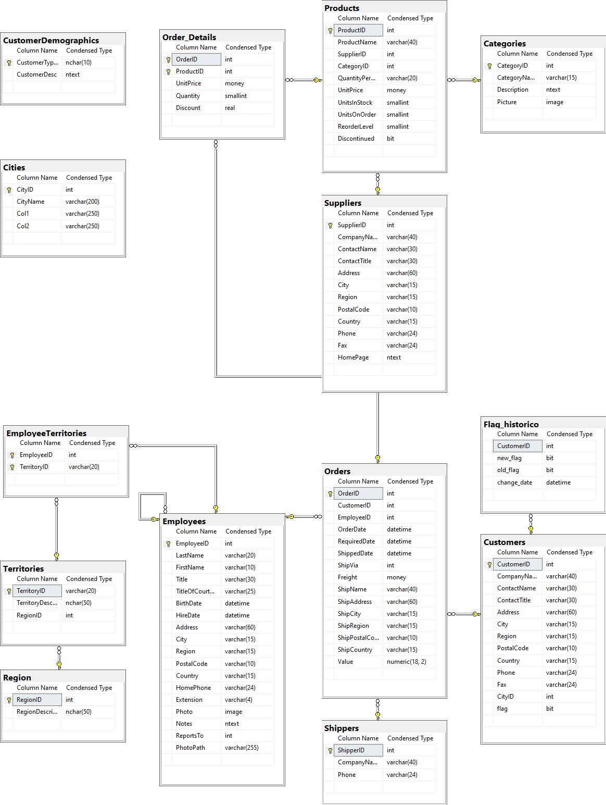

 # Gestão de OptIn e OptOut
 
  ```
 Artigo acadêmico desenvolvido para a matéria de Tópicos Avançados de Banco de Dados ministrada pelo 
 professor Eduardo Sakaue na FATEC São José dos Campos - Prof. Jessen Vidal.
  ```
 
 #### Contexto de aplicação
 
 ```
Conforme o consentimento ou não, por parte dos usuários, seus dados pessoais se tornam disponíveis, ou não,
para o tratamento por parte dos administradores desta base de dados, na qual a política de segurança
aplicada a nível de usuário leva em consideração o campo Flag da tabela de clientes para habilitar a
visualização e manipulação dos dados. O valor 1 no campo Flag indica o consentimento por parte do usuário,
já o valor 0 presente neste campo indica a revogação deste consentimento.

A política de segurança concede direitos totais aos “owners” (donos) da base de dados, não sendo aplicada a
eles, aos demais a mesma é aplicada normalmente e dependendo do valor presente no campo flag, os dados
estarão disponíveis ou não.

```

#### RLS – Row Level Security

```
A Segurança em nível de linha permite usar o contexto de execução ou a associação de grupo para controlar
restrições de acesso a linhas de dados. Nesse projeto utilizamos o predicado de filtro de segurança. A 
lógica dessa restrição de acesso é localizada na camada de banco de dados, em vez de longe dos dados em 
outra camada de aplicativo. O sistema de banco de dados aplica as restrições de acesso toda vez que há 
tentativa de acesso a dados a partir de qualquer camada; isso torna o sistema de segurança mais robusto e 
confiável, reduzindo a área de superfície do sistema de segurança.

Na implantação dessa tecnologia foi necessário definir uma função com valor de tabela embutida para 
filtrar o contexto de conexão e permissão no banco de dados para assim adicionar essa função como predicado
na política e segurança possibilitando silenciosamente filtrar as linhas disponíveis durante a leitura de 
dados da tabela base ao invés de apagar os dados quando não houver consentimento de uso do cliente.
```

#### Trigger

```
Para armazenar o histórico de permissões, criamos um gatilho que é ativado toda vez que houverem mudanças 
no consentimento do titular.
```

#### Modelo Entidade Relacionamento (MER)

<h1 align="center">
    
</h1>
