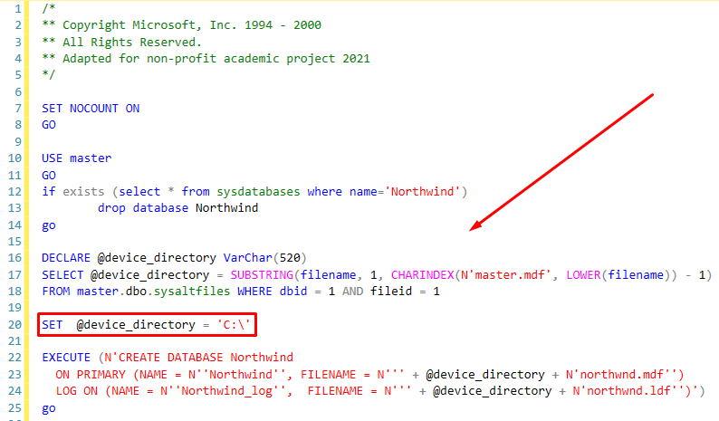
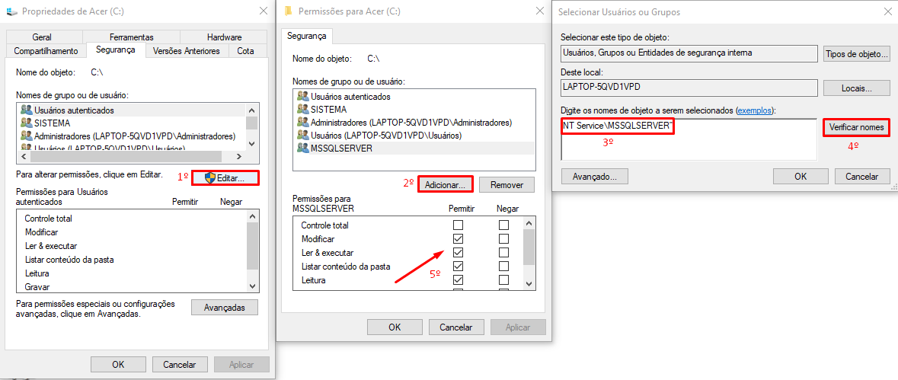
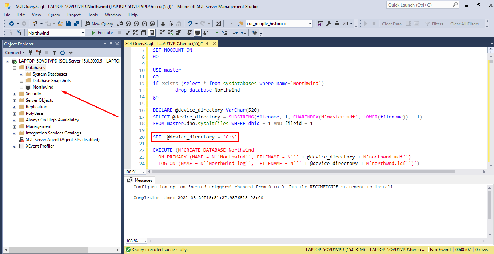
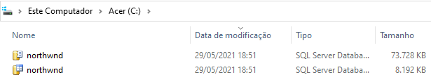
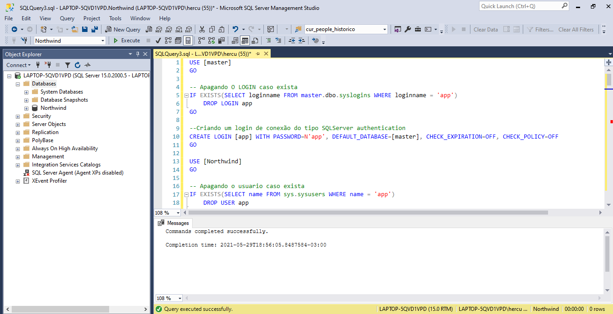
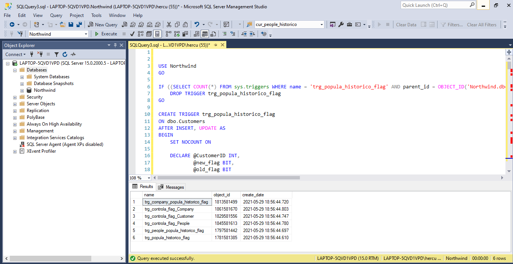
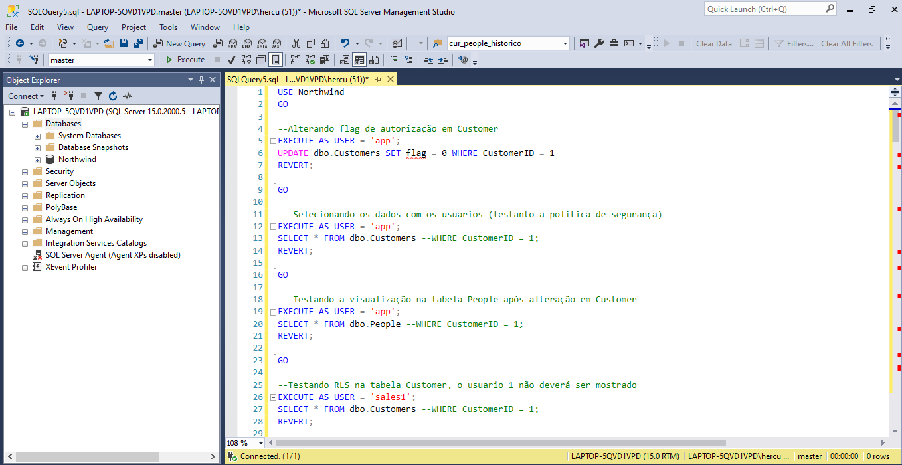
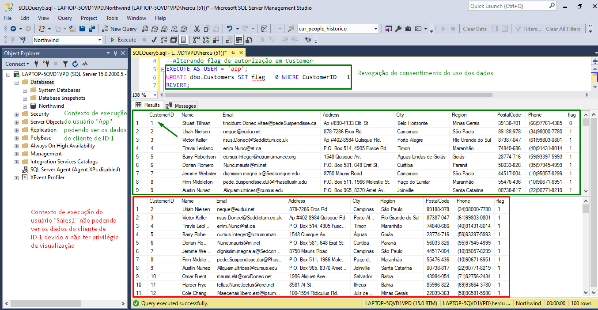

## Manual para a montagem da Base de Dados do ambiente.
 
  
Para utilização do projeto é necessario a instalação do Banco de Dados SQL Server 2016 (13.x) ou posterior.

Link da Microsoft:

https://www.microsoft.com/pt-br/sql-server/sql-server-downloads

É ideal também que se utilize uma IDE (Ambiente Integral de Desenvolvimento) para preparação do ambiente e execução dos scripts. Sugerimos a seguinte ferramenta:
SQL Server Management Studio (SSMS)

https://docs.microsoft.com/pt-br/sql/ssms/download-sql-server-management-studio-ssms?view=sql-server-ver15

Em cada Sprint do projeto foi criada uma pasta neste local do repositório contendo alguns scripts “.sql” que podem ser executados em conjunto para a criação da base de dados juntamente com seus registros e políticas de segurança, essas pastas foram criadas e nomeadas com o prefixo “sprint” seguido por um número (em ordem crescente, do menor para o maior) que indicam a ordem cronológica em que foram criadas.

Após instalação da base de dados e da interface de desenvolvimento siga os seguintes passos para preparação do banco de dados do ambiente:

Etapa 1:

Necessario escolher a versão do banco de dados utilizada em cada sprint do projeto, tendo em vista os seguintes tópicos:

-	Sprint1 - Banco de dados com política de segurança implantada na tabela Customers e histórico de alteração do consentimento do titular.
-	Sprint2 - Banco de dados com política de segurança implantada na tabela Customers e histórico de alteração do consentimento do titular.
-	Sprint3 - Banco de dados com política de segurança implantada na tabela Customers e histórico de alteração do consentimento do titular.
-	Sprint4 - Banco de dados com política de segurança implantada na tabela Customers e histórico de alteração do consentimento do titular.

Para o bom funcionamento do banco de dados do ambiente, o ideal é que sejam executados apenas um conjunto de arquivos “.sql” por pasta, pois dentro de cada uma delas contém arquivos específicos para a montagem de um determinado ambiente específico.

Neste tutorial utilizaremos arquivos da última sprint4:

O primeiro script a ser executado “1_northwind.sql” contem o caminho do diretório a ser salvo os arquivos de dados “.mdf” e de logs “.ldf”, caso seja necessario alteração do caminho do diretório basta alterar no seguinte comando:

<h1 align="center">
    
</h1>
 
É necessario garantir que o SQL Server tenha permissão de leitura, modificação e execução na diretório especificado.

Exemplo para conceder permissão ao usuário padrão “NT Service\MSSQLSERVER” do SQL Server no disco local (C:)

<h1 align="center">
    
</h1>

Após execução do script “1_northwind.sql” verificar a criação do banco de dados na IDE e no diretório especificado.

Evidências:

SQL Server Management Studio (SSMS)

<h1 align="center">
    
</h1>

Diretório especificado no script:

<h1 align="center">
    
</h1>

Adiante é necessario executar o script “2_RLS.sql” que irá criar os usuarios que serão utilizados pela aplicação além de implantar as políticas de segurança na base:

<h1 align="center">
    
</h1>

Por fim é necessario executar o último script “3_triggers.sql” para finalização das configurações do ambiente:

<h1 align="center">
    
</h1>

Nessa etapa todas as configurações necessárias para execução e funcionamento do projeto foram finalizadas. O arquivo “4_test_policy.sql” contém comando que podem ser executados para testa o funcionamento das políticas de segurança e o gerenciamento de Opt-in e Opt-out:

<h1 align="center">
    
</h1>

Podemos verificar o funcionamento das políticas de segurança observando alguns determinados registros onde o usuário proprietário revogou o consentimento para o tratamento de tais dados contidos nesses registros. Podemos observar que apenas os usuários “owners” da base conseguem tomar nota de determinados dados, pois os mesmos ficam inacessíveis aos demais usuários impedindo que sejam manipulados sem o consentimento do proprietário.

<h1 align="center">
    
</h1>

Após a execução destes passos, a base de dados do ambiente está montada.
