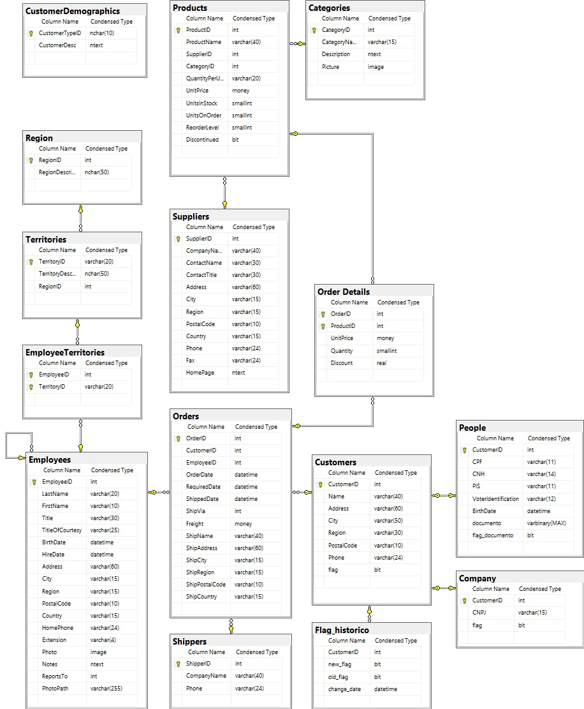

 ## Consentimento de menores de idade: anexar autorização dos pais ou responsável legal ou documento comprovante de emancipação, feito no banco (flag menor de idade).
 
  
 Artigo acadêmico desenvolvido para a matéria de Tópicos Avançados de Banco de Dados ministrada pelo 
 professor Eduardo Sakaue na FATEC São José dos Campos - Prof. Jessen Vidal.
 
 
 
 ### Alteração DDL (Data Definition Language) 
 
 
Para realizarmos o exercício da tratativa de dados perante o consentimento de menores de idade, adaptamos a base de dados padrão (Northwind) para que obtivéssemos clientes não somente jurídicos, mas também físicos.

Dentre as modificações realizadas no DDL da base de dados estão a adição de duas tabelas: Company (CustomerID, CNPJ, flag) e People (CustomerID, CPF, CNH, PIS, VoterIdentification, BirthDate, documento, flag_documento), que passam a ser identidade fraca da tabela Customer (CustomerID, Name, Address, City, Region, PostalCode, Phone, flag) que também sofreu modificações.

### Trigger

Foram criadas novas triggers que visam gerenciar o consentimento do uso dos dados dos clientes (trg_controla_flag_Company, trg_controla_flag_Customer, trg_controla_flag_People), inclusive verificando se os mesmos são menores de idade, visto que para realizar a tratativa de dados deste é preciso de um termo de responsabilidade assinado pelos responsáveis legais ou documento de emancipação, e registrar o histórico de modificações das permissões concedidas (trg_company_popula_historico_flag, trg_people_popula_historico_flag, trg_popula_historico_flag).

### RLS (Row Level Security)

Foram criadas também novas políticas de segurança que se estendem completamente aos dados dos clientes físicos (PeopleFilter) e jurídicos (CompanyFilter), que atuam em conjunto com a política segurança criada previamente (CustomerFilter), na qual os dados que não obtiveram consentimento do uso por parte do cliente não poderão ser vistos, exceto pelos usuários máximos (app, admin, sa).

### Novo Modelo Entidade Relacionamento (MER)

<h1 align="center">
    
</h1>
