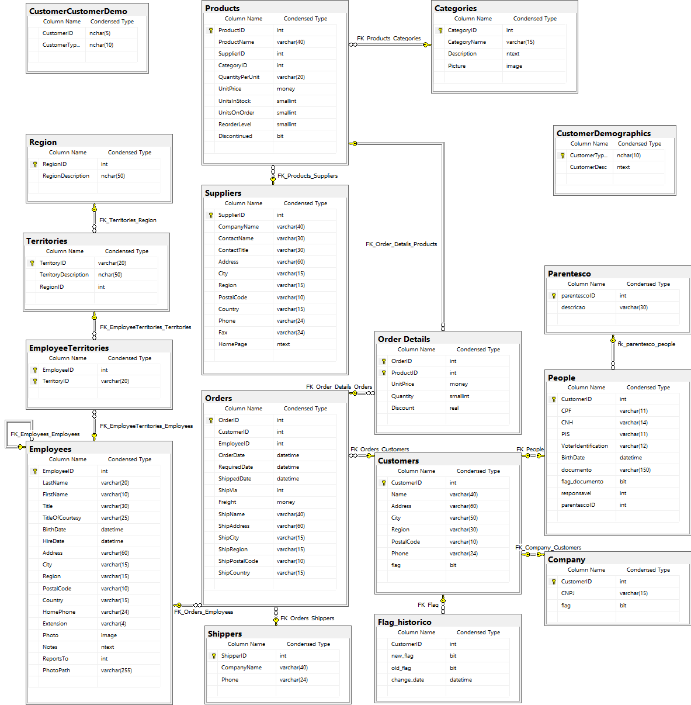

## Consentimento de menores de idade: anexar autorização dos pais ou responsável legal ou documento comprovante de emancipação, feito no banco (flag menor de idade).
 
  
 Artigo acadêmico desenvolvido para a matéria de Tópicos Avançados de Banco de Dados ministrada pelo 
 professor Eduardo Sakaue na FATEC São José dos Campos - Prof. Jessen Vidal.
 
 
 
 ### Alteração DDL (Data Definition Language) 
 
 
Para realizarmos o exercício da tratativa de dados perante o consentimento de menores de idade, adaptamos a base de dados padrão (Northwind) para que obtivéssemos clientes não somente jurídicos, mas também físicos.

Dentre as modificações realizadas no DDL da base de dados estão a adição de dois campos na tabela People (responsavel, parentescoID) onde parentescoID é chave estrangeira para a nova tabela criada, Parentesco (parentescoID, descricao) onde são armazenados a descrição do responsável caso o cliente seja menor de idade, contendo as seguintes possibilidades de valores (Responsavel Legal, Mãe, Pai).

### Trigger

Houveram alterações na trigger “trg_controla_flag_People” que visa gerenciar o consentimento do uso dos dados dos clientes, verificando se os mesmos são menores de idade, visto que para realizar a tratativa de dados deste é preciso: Indicar responsável legal na base de dados ou inserir um termo de responsabilidade assinado pelos responsáveis legais ou documento de emancipação.

### RLS (Row Level Security)

A política de segurança implantada anteriormente se manteve.

### Novo Modelo Entidade Relacionamento (MER)

<h1 align="center">
    
</h1>
