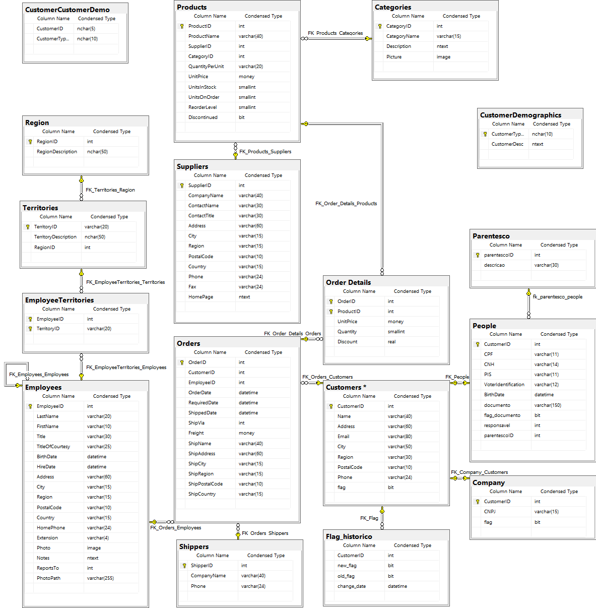

## Consentimento de menores de idade: anexar autorização dos pais ou responsável legal ou documento comprovante de emancipação, feito no banco (flag menor de idade).
 
  
 Artigo acadêmico desenvolvido para a matéria de Tópicos Avançados de Banco de Dados ministrada pelo 
 professor Eduardo Sakaue na FATEC São José dos Campos - Prof. Jessen Vidal.
 
 
 
 ### Alteração DDL (Data Definition Language) 
 
 
O DDL do banco de dados foi alterado com a adição de um campo chamado "Email" na tabela "Customers".

### Trigger

Não houveram alterações nas triggers.

### RLS (Row Level Security)

A política de segurança implantada anteriormente se manteve inalterada.

### Novo Modelo Entidade Relacionamento (MER)

<h1 align="center">
    
</h1>
